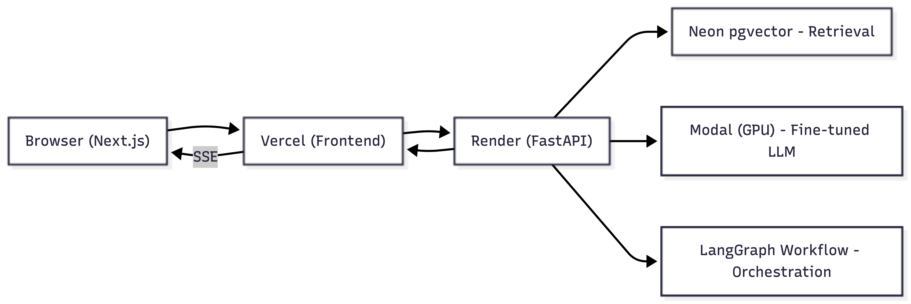
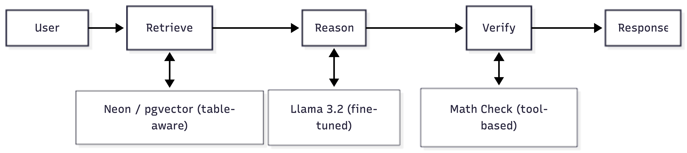

 # Fathom Financial Agent

> An AI agent that performs structured reasoning on complex financial queries in 10-K reports with production cost under 50¢. 

[](https://fathomfinancialagent.vercel.app)
[](https://www.langchain.com/langgraph)
[](https://huggingface.co/PrestoOverture/fathom-llama-3b-merged)

[](https://github.com/user-attachments/assets/1d8fe672-ec4e-443c-91e5-a0067ae96357)

---

## The Problem

Generic RAG systems fail at financial analysis because text-based PDF parsers flatten financial tables into unstructured text, destroying row/column relationships. They retrieve text but cannot calculate derived metrics (e.g., "What was the YoY change in operating margin?"). This project aim to address both problems: LlamaParse preserves table structure during ingestion, and a fine-tuned Llama 3.2 3B model performs explicit step-by-step reasoning and calculation over the retrieved evidence.

---

## The Solution

1. Filtered data with "reasoning" label as well as data with no label but passed LLM judge's approvel.
2. Distilled **GPT-4o reasoning traces** on the training set using batch API.
3. Built a validation pipeline to ensure distilled reasoning traces follow the correct reasoning format and no data leakage from the training set to the probe/dev/test sets.
4. Finetuned **Llama 3.2 3B** using 4-bit LoRA via Unsloth on Google Colab (Tesla T4).
5. Deployed the finetuned model on **Modal**.
6. Set up **Neon (PostgreSQL)** with pgvector and implemented **LlamaParse** for ingestion.
7. Developed the **LangGraph** workflow.
8. Integrated the data pipelines with **FastAPI Backend**.
9. Built a **Next.js** UI.
10. Deployed frontend on **Vercel** and backend on **Render**.

### Architecture



### LangGraph Workflow



---

## Tech Stack

| Layer | Stack |
|-------|------------|
| Frontend | Next.js 14, Tailwind CSS, TypeScript |
| Backend | FastAPI, Server-Sent Events |
| Orchestration | LangGraph |
| Vector Store | Neon (PostgreSQL + pgvector) |
| Document Parsing | LlamaParse |
| Model Inference | Modal (Serverless GPU) |
| Fine-tuning | Unsloth, LoRA, Google Colab T4 |
| Base Model | Llama 3.2 3B Instruct |
| Teacher Model | GPT-4o |
| Judge | GPT-4o-mini |

---

## Project Structure

```
fathom-financial-agent/
├── api/                    # FastAPI backend
│   ├── main.py
│   ├── schemas.py
│   └── sse.py
├── graph/                  # LangGraph workflow
│   ├── nodes/
│   │   ├── retrieve.py
│   │   ├── reason.py
│   │   └── verify.py
│   ├── state.py
│   └── workflow.py
├── frontend/               # Next.js application
├── src/                    # Data pipeline scripts
│   ├── 1_filter_data.py
│   ├── 2_audit_data.py
│   ├── 3_generate_traces.py
│   ├── 4_validate_traces.py
│   ├── 6_ingest.py
│   ├── ... the rest of the pipelines
├── data/                   # Training data & caches
└── results/                # Evaluation outputs
```

---

## Quick Start

### Prerequisites

- Python 3.10+
- Node.js 18+
- API keys: OpenAI, LlamaCloud, Modal, Neon

### Project Setup

```bash
# Clone the repository
git clone https://github.com/prestooverture/fathom-financial-agent.git
cd fathom_financial_agent

# Install dependencies
uv sync

# Set environment variables
cp .env.example .env
# Don't forget to add .env with your API keys

# Run the backend
uvicorn api.main:app --reload

# Run the frontend
cd frontend && npm run dev
```

---

## How It Works

### 1. Document Ingestion

PDFs are processed through LlamaParse, which uses vision models to reconstruct financial tables as structured Markdown. This preserves the row/column relationships that are critical for accurate retrieval.

### 2. Query Processing

When a user asks a question:

1. **Retrieve** — Semantic search over pgvector finds relevant chunks, prioritizing table nodes
2. **Reason** — The fine-tuned Llama 3.2 3B generates a structured reasoning trace with explicit calculation steps
3. **Verify** — A Python-based math engine checks any arithmetic in the response against the stated inputs

### 3. Streaming Response

Results stream back to the user in real-time via SSE, with the reasoning trace shown in a collapsible panel.

---

## Results
**Format Adherence:** Is the model following the correct reasoning format?

| Run | Valid / Total | Rate |
| --- | --- | --- |
| Baseline (original) | 0 / 15 | 0.0% |
| Finetuned (original) | 7 / 15 | 46.7% |
| Baseline (LlamaParse) | 9 / 15 | 60.0% |
| Finetuned (LlamaParse) | 13 / 15 | 86.7% |

**Correctness (LLM judge):** Is the final answer correct? (Results are based on shared vector store)

| Run | Correct | Incorrect | Refused | Accuracy |
| --- | --- | --- | --- | --- |
| Baseline (original) | 6 | 9 | 0 | 40.0% |
| Finetuned (original) | 4 | 11 | 0 | 26.7% |
| Baseline (LlamaParse) | 4 | 9 | 2 | 26.7% |
| Finetuned (LlamaParse) | 4 | 11 | 0 | 26.7% |

**Retrieval Recall@5 (LLM judge):** At least one of the top-5 chunks was judged sufficient to answer the question.

- Hit count: 5 / 15  
- Recall@5: **33.3%**

### Result Analysis
- Format adherence improved substantially after fine-tuning.
- Model experienced alignment tax after being finetuned, thus resulting in reduced accuracy on the orginal oracle RAG.
- Low recall indicates that the model is blind 67% of the time.
- An accuracy of 26.7% means LlamaParse with table awareness is the way to go, because **GPT-4o-Turbo** only achieved 19% accuracy on a shared vector store in the Financebench paper.
  
---

## Limitations & Future Work

**Current Limitations:**
- Current retrieval strategy (similarity based) is too simple and thus cannot reflect the true model performance due to low recall. Finding the correct context from 100-200 pages of financial form remains challenging. 
- Limited to 10-K annual reports, or similar questions that require reasoning
- Verification loop sometimes cannot identify the equation
- Verification loop cannot catch logical errors

**Future Improvements:**
- Consider advanced RAG strategy, e.g., Agentic RAG
- Consider having a fine-tuned embedding model for financial domain
- Confidence scoring for answers
- Use a MCP calculator to handle arithmetic errors
- Start with frontier models, then reduce

---

## Acknowledgments

[FinanceBench](https://github.com/patronus-ai/financebench) by Patronus AI — The benchmark dataset that made rigorous evaluation possible
