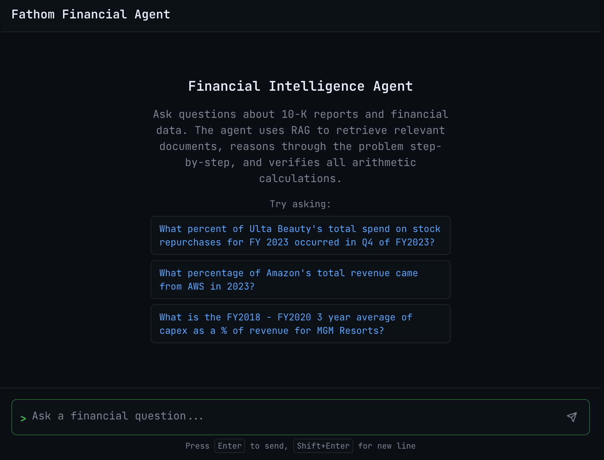
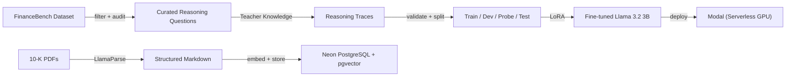
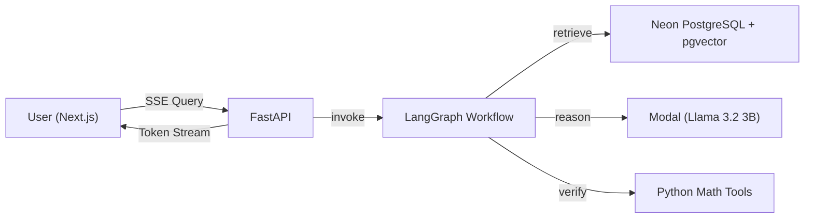
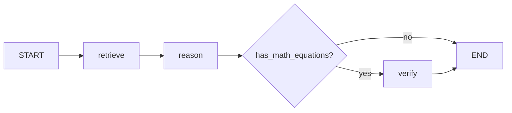

 # Fathom Financial Agent

> An AI agent that performs structured reasoning on complex financial queries in 10-K reports with end-to-end cost under 50¢. 

[](https://fathomfinancialagent.vercel.app)
[](https://www.langchain.com/langgraph)
[](https://huggingface.co/PrestoOverture/fathom-llama-3b-merged)

[](https://github.com/user-attachments/assets/1d8fe672-ec4e-443c-91e5-a0067ae96357)

---

## The Problem

Generic RAG systems fail at financial analysis because text-based PDF parsers flatten financial tables into unstructured text, destroying row/column relationships. They retrieve text but cannot calculate derived metrics (e.g., "What was the YoY change in operating margin?"). This project aim to address both problems: LlamaParse preserves table structure during ingestion, and a fine-tuned Llama 3.2 3B model performs explicit step-by-step reasoning and calculation over the retrieved evidence.

---

## The Solution

1. Filtered data with "reasoning" label as well as data with no label but passed LLM judge's approvel.
2. Distilled **GPT-4o reasoning traces** on the training set using batch API.
3. Built a validation pipeline to ensure distilled reasoning traces follow the correct reasoning format and no data leakage from the training set to the probe/dev/test sets.
4. Finetuned **Llama 3.2 3B** using 4-bit LoRA via Unsloth on Google Colab (Tesla T4).
5. Deployed the finetuned model on **Modal**.
6. Set up **Neon (PostgreSQL)** with pgvector and implemented **LlamaParse** for ingestion.
7. Developed the **LangGraph** workflow.
8. Integrated the data pipelines with **FastAPI Backend**.
9. Built a **Next.js** UI.
10. Deployed frontend on **Vercel** and backend on **Render**.

### Architecture

#### Data Pipeline



#### Query Flow



### LangGraph Workflow



---

## Project Structure

```
fathom-financial-agent/
├── api/                    # FastAPI backend
│   ├── main.py
│   ├── schemas.py
│   └── sse.py
├── graph/                  # LangGraph workflow
│   ├── nodes/
│   │   ├── retrieve.py
│   │   ├── reason.py
│   │   └── verify.py
│   ├── state.py
│   └── workflow.py
├── frontend/               # Next.js application
├── src/                    # Data pipeline scripts
│   ├── 1_filter_data.py
│   ├── 2_audit_data.py
│   ├── 3_generate_traces.py
│   ├── 4_validate_traces.py
│   ├── 6_ingest.py
│   ├── ... the rest of the pipelines
├── data/                   # Training data & caches
└── results/                # Evaluation outputs
```

---

## Quick Start

### Prerequisites

- Python 3.13+
- Node.js 18+
- API keys: OpenAI, LlamaCloud, Modal, Neon

### Project Setup

```bash
# Clone the repository
git clone https://github.com/prestooverture/fathom-financial-agent.git
cd fathom_financial_agent

# Install dependencies
uv sync

# Set environment variables
cp .env.example .env
# Don't forget to add .env with your API keys

# Run the backend
uvicorn api.main:app --reload

# Run the frontend
cd frontend && npm run dev
```

---

## Results
**Format Adherence:** Is the model following the correct reasoning format?

| Run | Valid / Total | Rate |
| --- | --- | --- |
| Baseline (oracle) | 0 / 15 | 0.0% |
| Finetuned (oracle) | 7 / 15 | 46.7% |
| Baseline (LlamaParse) | 9 / 15 | 60.0% |
| Finetuned (LlamaParse) | 13 / 15 | 86.7% |

**Correctness (LLM judge):** Is the final answer correct?

| Run | Correct | Incorrect | Refused | Accuracy |
| --- | --- | --- | --- | --- |
| Baseline (oracle) | 6 | 9 | 0 | 40.0% |
| Finetuned (oracle) | 4 | 11 | 0 | 26.7% |
| Baseline (LlamaParse) | 4 | 9 | 2 | 26.7% |
| Finetuned (LlamaParse) | 4 | 11 | 0 | 26.7% |
| Finetuned (fixed retrieval) | 4 | 11 | 0 | 26.7% |

**Retrieval Recall@5 — Ablation Study:**

| Stage | Config | Recall@5 |
|-------|--------|----------|
| Baseline | Pure vector similarity, top_k=5 | 33.3% |
| + Metadata filtering | Company/year filter, top_k=5 | 26.7% |
| + Wider window | Company/year filter, top_k=15 | 26.7% |
| + Reranker | Company/year filter, top_k=15, bge-reranker-base | **40.0%** |

### Result Analysis
- Format adherence improved substantially after fine-tuning (0% to 86.7%).
- Model experienced alignment tax after being finetuned, resulting in reduced accuracy on the original oracle RAG.
- Metadata filtering correctly narrows to the right document (13/15) but within-document chunk relevance remains the bottleneck. The cross-encoder reranker provides the only measurable lift (+6.7% over baseline).
- An accuracy of 26.7% means LlamaParse with table awareness is the way to go, because **GPT-4o-Turbo** only achieved 19% accuracy on a shared vector store in the Financebench paper.
  
---

## Limitations & Next Steps

**Design tradeoffs:**
- **Small model by design.** A 3B parameter model keeps inference cost very low but trades off arithmetic reliability — the model learns *how* to reason but lacks the capacity to execute multi-step math consistently. The verify node catches some errors; a tool-use or larger model approach would close the gap.
- **Embedding-based retrieval over financial tables.** General-purpose embeddings (`text-embedding-3-small`) rank prose higher than tabular data, so financial statements sometimes don't surface even when the correct document is identified. This is an inherent limitation of dense retrieval over structured content.
- **Scoped to 10-K annual reports.** The system is purpose-built for SEC 10-K filings and FinanceBench-style reasoning questions — it does not generalize to other document types or open-domain financial QA.

**Next experiments:**
- Table-aware retrieval — section-level chunking or hybrid search features that target financial tables directly, since retrieval quality is the dominant blocker before model size
- Agentic RAG with query decomposition for multi-step calculations that exceed single-pass reasoning

---

## Acknowledgments

[FinanceBench](https://github.com/patronus-ai/financebench) by Patronus AI — The benchmark dataset that made rigorous evaluation possible
